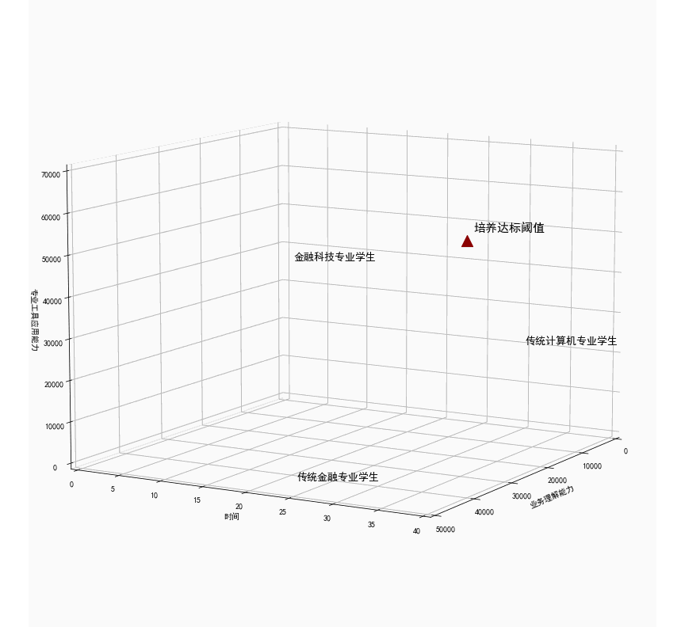

# FintechCultivateSimulation

## Introduction
It's the simulation of the Challenger Cup Project  
(On the Evaluation Index System and Collaborative Training Mechanism of FinTech Interdisciplinary Talents)

## Structure of Project
1.Student Class  
2.Data Collector Class  
3.Main Part  
4.Quantile Part  
5.Statistics Part  
6.Dynamic Part

## Output of the Simulation
The static form of the simulation

The dynamic form of the simulation
